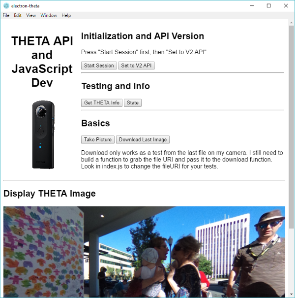

# Control RICOH THETA S Camera API with JavaScript

This is a quick test of accessing the RICOH THETA S API
with electron. It only uses a handful of commands right now. It's intended as code for 
[this tutorial](http://lists.theta360.guide/t/howto-develop-360-image-desktop-apps-with-javascript-and-ricoh-theta/1353?u=codetricity).

It provides a template skeleton for application developers. It is not intended
to be used by photographers.

## Prerequisites

### Install Electron

    npm install electron -g

If npm is not on your system, install 
[Node.js](https://nodejs.org/en/)

### Install node-rest-client

    npm install node-rest-client --save

## Camera State
The camera must be connected to your computer with
WiFi. I am using firmware 01.82. You can check and 
upgrade the camera firmware with the RICOH THETA Official Desktop application.

## Reference
* [THETA API v2.1](https://developers.theta360.com/en/docs/v2.1/api_reference/)
* [node-rest-client](https://www.npmjs.com/package/node-rest-client)
* [electron](https://electron.atom.io/)
* [Node.js](https://nodejs.org/en/)
* [Google VR View for the Web](https://developers.google.com/vr/concepts/vrview-web) used for 360 image display
* [Google Open Spherical Camera API](https://developers.google.com/streetview/open-spherical-camera/) that the THETA API is based on and compliant with

## Screenshot

